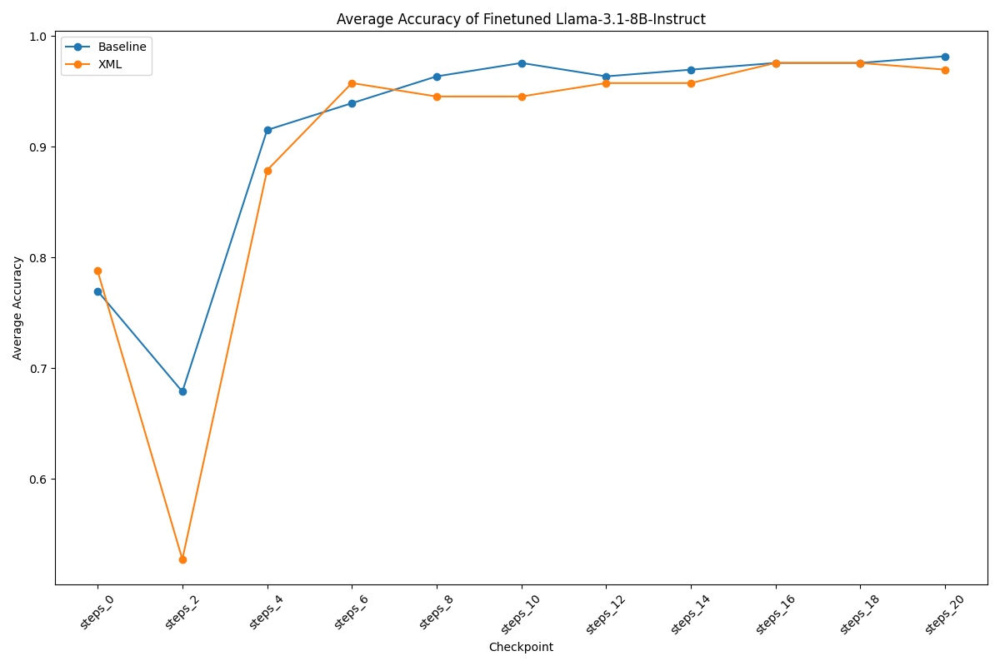
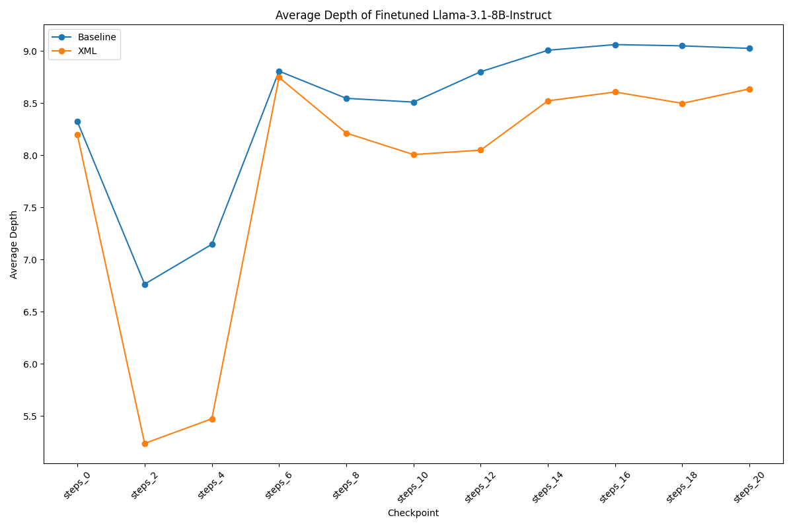
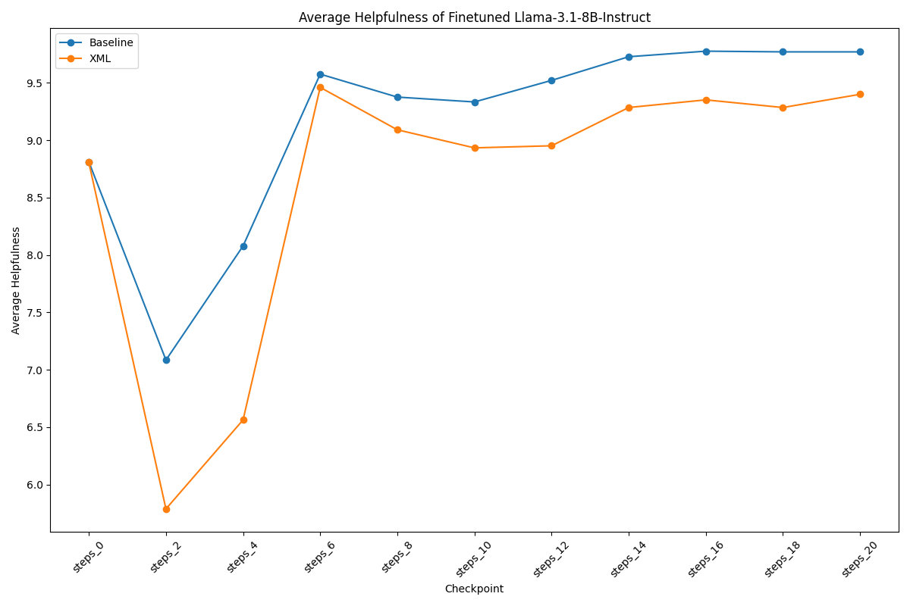
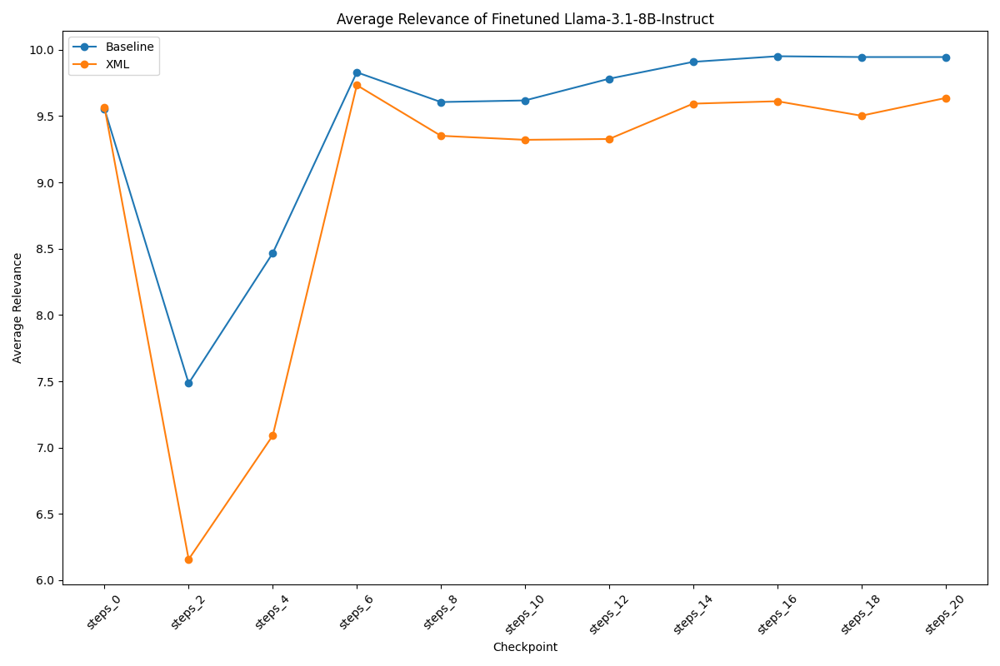

# Finetune-RAG: Fine-tuning Models to Tackle Retrieval-Augmented Generation (RAG) Hallucination

This repository provides an open-source framework to fine-tune large language models (LLMs) for improving their ability to discern correct information from irrelevant or fictitious data when using Retrieval-Augmented Generation (RAG) systems. By training models to distinguish between relevant and misleading contexts, we aim to reduce the hallucination problem in LLM-generated responses, enhancing the reliability of models in real-world use cases.

## Problem Overview

When integrating retrieval into LLM workflows, models often rely on external documents to provide factual information in response to user queries. However, if incorrect or irrelevant documents are retrieved, the model may generate incorrect responses by "hallucinating" based on misleading data. This repository addresses the issue by fine-tuning models to:

- Recognize and ignore fictitious or irrelevant documents.
- Focus on relevant, factually correct context.
- Generate accurate answers, even when faced with conflicting or unreliable data.

## Approach

Our method involves fine-tuning LLMs using carefully designed prompts that provide two types of data:

1. **A correct, factually grounded chunk**.
2. **A fictitious, misleading chunk**.

The fine-tuning process teaches the model to focus solely on the correct chunk, filtering out the irrelevant or false context. The training labels are the correct answers based on the factual context, guiding the model to avoid using the fictitious information during generation.

### Key Steps

1. **Data Construction**:
   - For each training example, the model is given a question, one chunk of data that contains the correct information, and a second chunk that contains fictitious information.

2. **Training Objective**:
   - The model is trained to generate a correct answer by leveraging the factual chunk while ignoring the fictitious one.

3. **Evaluation**:
   - We evaluate using **Bench-RAG**, our devised LLM-as-a-judge framework. During evaluation, the model is tested on its ability to provide accurate answers, with performance measured by its capacity to ignore misleading data and produce responses based only on the correct context, as judged by GPT4o.

## Setup

### Install conda

```bash
wget https://repo.anaconda.com/miniconda/Miniconda3-latest-Linux-x86_64.sh && \
sh Miniconda3-latest-Linux-x86_64.sh
```

Source just to be sure `conda` cli will be available:

```bash
source ~/.bashrc
```

Sometimes if you still face `conda: command cannot be found`, you can find the installation and source it:

`Note: This path assumes you took up the default installation settings. Otherwise, find where you installed it.`

```bash
source ~/miniconda3/etc/profile.d/conda.sh
```

## Clone this repo

```bash
git clone https://github.com/Pints-AI/Finetune-Bench-RAG.git && \
cd Finetune-Bench-RAG
```

## Create conda env

```bash
conda create --prefix ./.conda python=3.10 && \
conda activate ./.conda
```

`Note`: Stick to Python 3.10. 3.12 breaks a lot of things as of now (23 Feb 2024), and 3.11 has not been tested.

## Install CUDA toolkit

```bash
conda install nvidia/label/cuda-12.1.1::cuda-toolkit
```

## Install requirements

```bash
pip install torch==2.6.0 && \
pip install -r requirements.txt
```

## Training

### Dataset Preparation

The dataset used in this project consists of over 1,600 documents manually scraped from a wide range of sources. These documents are organised into categories, including legal documents (e.g., contracts, governance, compliance), research papers from multiple scientific fields, books (both fiction and non-fiction), web content, news articles, parliamentary debates, and government publications. Additionally, the dataset includes industry-specific documents such as technical documentation, patents, market research, and code repositories.

This diverse dataset ensures that the model is exposed to varied contexts, allowing it to learn how to identify and filter out irrelevant or fictitious information across multiple domains. You can access it from our [Hugging Face dataset page](https://huggingface.co/datasets/pints-ai/Finetune-RAG).

Before training, download the dataset:

```bash
huggingface-cli download --local-dir dataset/ --repo-type dataset pints-ai/Finetune-RAG
```
Afterwards, process the dataset to suit the training pipeline. Refer to the [`prepare_dataset/`](prepare_dataset/) folder for more information.

### Model preparation

Generally, most huggingface-compatible causal language models should work fine with our codebase, potentially with some adjusting for different tokenizers etc. Some models may require additional requests to download. E.g., for LLaMa, please consult [the Hugging Face documentation](https://huggingface.co/docs/transformers/model_doc/llama) for requesting access and converting them to a huggingface-compatible format.

Notably, we want to finetune instruct models to retain its conversational capabilities.

### Prompt Strategy

We have standardised the way we include the retrieved content in the prompt:

#### System Message

For all training, our system message is as follows:

```python
SYSTEM_PROMPT = 'Some information is retrieved from the database as provided based on the user’s question. The assistant is to answer the question to the best of his/her ability, using only the information provided. The assistant must not add his/her own knowledge.'
```

The goal of SFT is to enhance the model's ficticious content recognition capabilities. As such, we do not wish to overly prompt-engineer and influence the model in its choice of content used in its answer generation.

#### User Message

We have defined the message into two categories: Baseline & XML

The Baseline user message serves to generically provide the content to the model. We train the model with one genuine content, and one fictitious content, with its order at random. The format is as follows:

```
Filename: {filename1}
Information:
{content1}

Filename: {filename2}
Information:
{content2}

Question: {question}
```

The XML user message is similar, but with its content encapsulated with XML tags:
```
<Results>
    <Result>
        <Filename>{filename1}</Filename>
        <Information>{content1}</Information>
    </Result>
    <Result>
        <Filename>{filename2}</Filename>
        <Information>{content2}</Information>
    </Result>
</Results>

Question: {question}
```

We conduct separate SFTs for both formats. Results are below.

### Finetuning

The codebase is `deepspeed`-with-`accelerate` enabled. If the [various existing `deepspeed` configs](configs/deepspeed/) are not what you are looking for, path your custom config into the execution command.

Below is an example command to run finetuning on Llama3.1-8B-Instruct model:

```bash
accelerate launch \
    --mixed_precision bf16 \
    --num_machines 1 \
    --num_processes 1 \
    --use_deepspeed \
    --deepspeed_config_file configs/ds_configs/stage2_offloading_accelerate.conf \
    finetunerag/finetune.py \
    --model_name_or_path ../Llama-3.1-8B-Instruct \
    --tokenizer_name_or_path ../Llama-3.1-8B-Instruct \
    --use_flash_attn \
    --max_seq_length 4096 \
    --preprocessing_num_workers 128 \
    --per_device_train_batch_size 1 \
    --gradient_accumulation_steps 64 \
    --learning_rate 2e-5 \
    --lr_scheduler_type cosine \
    --beta1 0.9 \
    --beta2 0.95 \
    --warmup_ratio 0.1 \
    --weight_decay 0.1 \
    --num_train_epochs 1 \
    --enable_wandb \
    --logging_steps 1 \
    --checkpointing_steps 2 \
    --prompt_style llama3.1 \
    --validation_step 1 \
    --wandb_project Finetuning \
    --wandb_name Llama-3.1-8B-Instruct-Finetuned \
    --train_file dataset/splits/train.jsonl \
    --validation_file dataset/splits/validation.jsonl \
    --output_dir ../models/Llama-3.1-8B-Instruct-Baseline/
```

Make sure to adjust `model_name_or_path`, `tokenizer_name_or_path`, `train_file`, and `output_dir` to your models / data / setting.

### Released Checkpoints

We have finetuned Llama-3.1-8B-Instruct to tackle RAG hallucination. We used 1xH100 GPU, with a micro-batch size of 1, and a batch size of 64 per step. See the sample finetuning command above for more information of the hyperparameters used. Our checkpoints can be found here:

- [Baseline-tuned(checkpoints: steps_2-10)](https://huggingface.co/pints-ai/Llama-3.1-8B-Instruct-RAG_Baseline_tuned-1).
- [Baseline-tuned(checkpoints: steps_12-20)](https://huggingface.co/pints-ai/Llama-3.1-8B-Instruct-RAG_Baseline_tuned-2).
- [XML-tuned(checkpoints: steps_2-10)](https://huggingface.co/pints-ai/Llama-3.1-8B-Instruct-RAG_XML_tuned-1).
- [XML-tuned(checkpoints: steps_12-20)](https://huggingface.co/pints-ai/Llama-3.1-8B-Instruct-RAG_XML_tuned-2).

## Evaluation

### Bench-RAG

We have devised a benchmark strategy, namely **Bench-RAG**, with the help of GPT-4o to identify whether the outputs generated by the model is factually accurate even after provided with ficticious data in its prompt. See the [`benchrag/`](benchrag/) folder for more information about how it works and its execution.

Below is the results of the finetuned Llama-3.1-8B-Instruct:






## Acknowledgements
The structure of our codebase is referenced from the [Open-Instruct repository](https://github.com/allenai/open-instruct).

## Licence
This codebase is licensed under Apache 2.0 as given in LICENSE.
